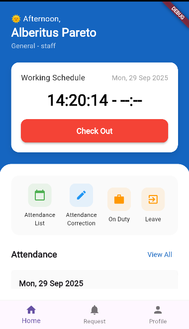
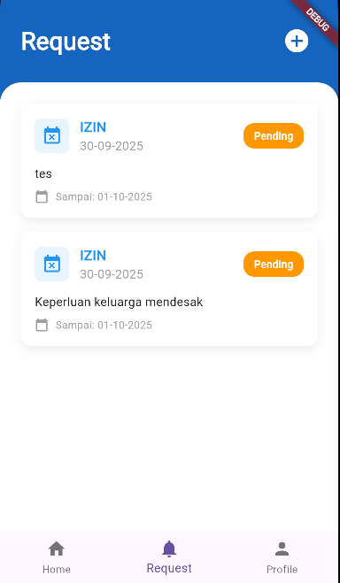
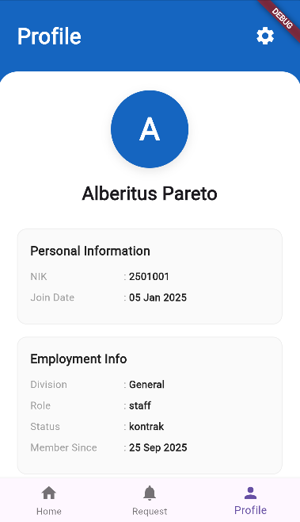
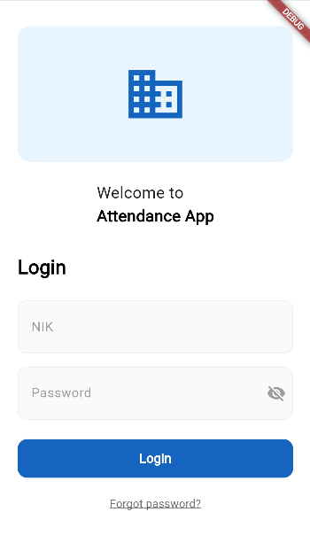

# 📲 Presensi App

Presensi App adalah aplikasi absensi karyawan yang dibangun menggunakan **Flutter (Dart)** untuk frontend dan **Laravel** untuk backend.  
Aplikasi ini mendukung login karyawan, pengajuan request, dan manajemen profil dengan tampilan modern dan smooth animation.

🔗 **Backend:** [Presensi Backend – Laravel](https://github.com/alberitus/presensi-backend)

---

## 🚀 Fitur Utama
- Login & Authentication karyawan
- Halaman **Home** untuk ringkasan kehadiran
- Halaman **Request** untuk pengajuan izin/lembur
- Halaman **Profile** untuk data pribadi
- UI modern & clean, terinspirasi dari [Human Capital Management Apps – Dribbble](https://dribbble.com/shots/23052271-Human-Capital-Management-Apps)
- Terintegrasi dengan API Laravel

---

## 🖥️ Tampilan Aplikasi

| Home Screen | Request Screen | Profile Screen | Login Screen |
|-------------|----------------|----------------|--------------|
|  |  |  |  |

> *UI dapat berubah sesuai pengembangan.*

---

## 🛠️ Teknologi yang Digunakan
- **Frontend:** Flutter **3.35.4** (Stable) – Framework UI untuk membangun aplikasi cross-platform (Android/iOS/Web/Desktop).
- **Bahasa Pemrograman:** **Dart 3.9.2** – Bahasa inti yang digunakan oleh Flutter.
- **State Management:** `setState` (built-in) / `Provider` (opsional untuk pengelolaan state yang lebih kompleks).
- **Backend:** **Laravel 10** – Framework PHP untuk RESTful API dan manajemen data di server.
- **Database:** **MySQL** – Digunakan untuk penyimpanan data absensi dan user.
- **API:** **RESTful API** – Komunikasi antara aplikasi Flutter dan backend Laravel.
- **Version Control:** **Git & GitHub** – Untuk pengelolaan kode dan kolaborasi.
- **Tools:** **DevTools 2.48.0** – Debugging & performance tools bawaan Flutter.

---

## ⚙️ Cara Menjalankan
1. Clone repository ini:
   ```bash
   git clone https://github.com/alberitus/presensi-app.git
   cd presensi-app
   flutter pub get
   flutter pub upgrade --major-versions
   flutter run
